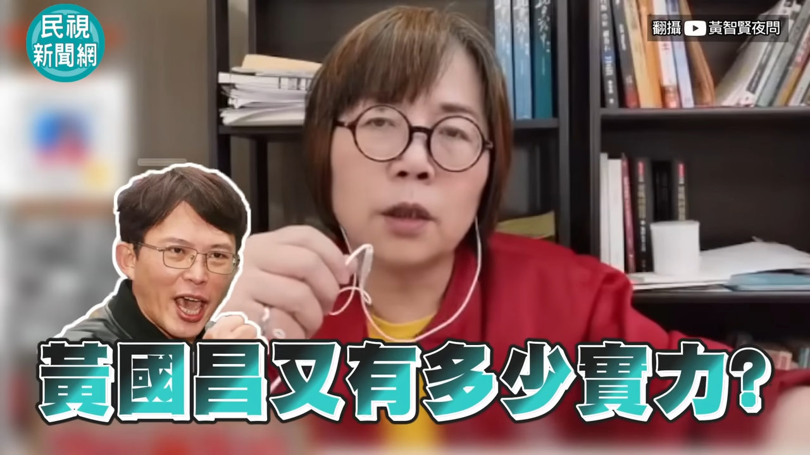
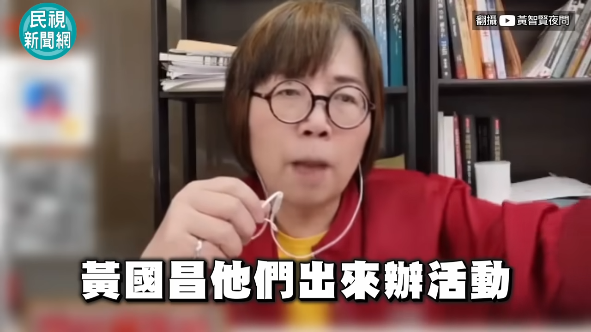
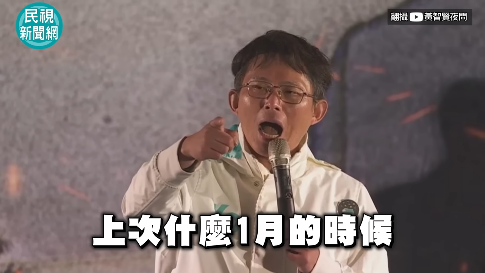
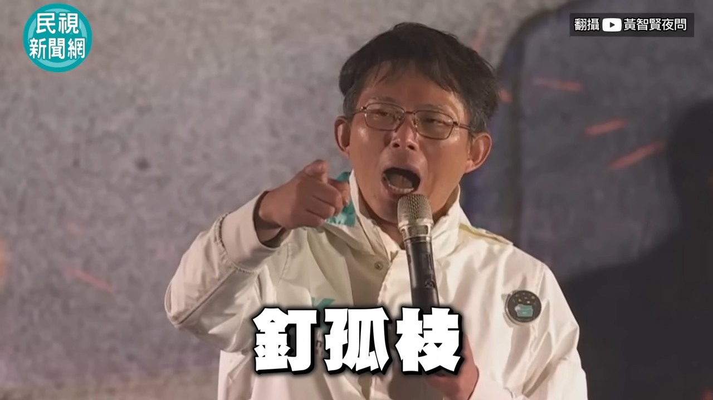
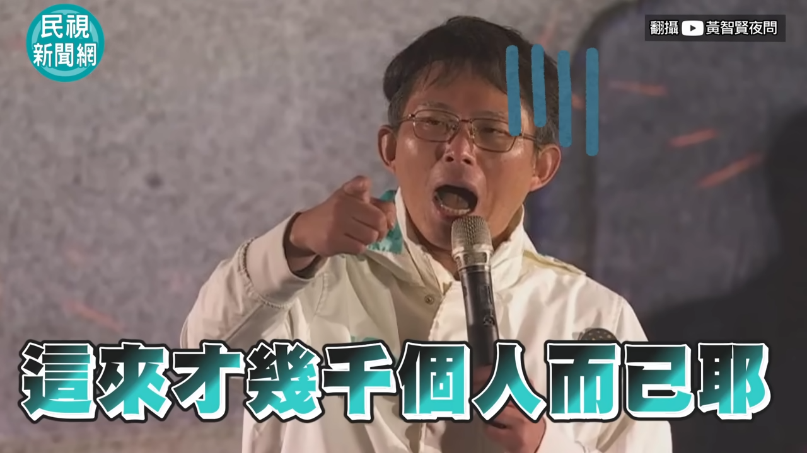
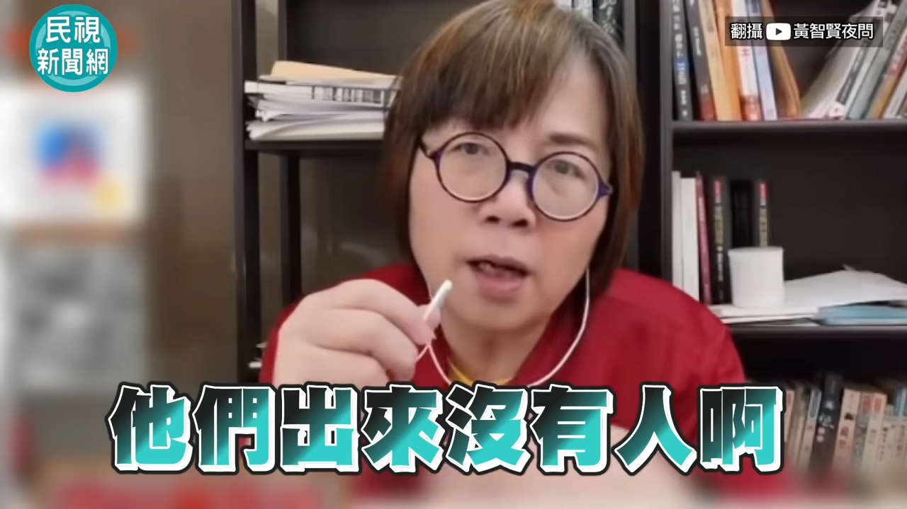
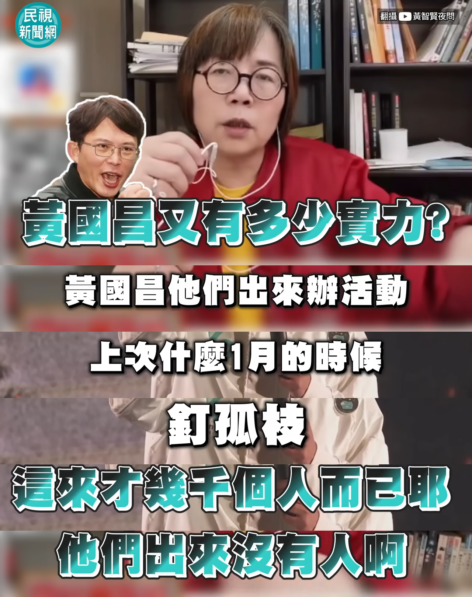

# 連續圖文合成器 使用說明

## 下載

可執行文件 (.exe) 下載網址 (或到右側 Releases 區域下載最新版本):
[https://github.com/Learn-Long/Continuous-Graphics-Synthesizer/releases/download/CGS/default.exe](https://github.com/Learn-Long/Continuous-Graphics-Synthesizer/releases/download/CGS/default.exe)

(注意：以上連結指向您提供的特定版本，用戶也可以查看 Releases 獲取最新版)

## 使用說明

1.  先到 Youtube 打開你想製作台詞拼接圖的影片，手動定位到包含所需字幕的時間點並暫停播放。
2.  在影片畫面上**連續點擊兩下滑鼠右鍵**，會出現瀏覽器原生選單，選擇「**將視頻幀另存為...**」(Save video frame as...)。
3.  依此類推，保存若干張包含連續字幕的圖片幀。檔名可以不用修改，程式會依據檔案建立時間排序。例如：
    
    
    
    
    
    

4.  將下載的 `default.exe` (或您自行編譯的 `merge_images.exe`) 程式，跟這些保存下來的圖片**放在同一個文件夾**中。
5.  運行 `default.exe` 程式。程式會提示您輸入一個百分比數值 (0-100)，代表要保留每張圖片**底部**多少高度的區域。
    *   這個數值需要您目測判斷字幕大約佔據畫面下方多少百分比。
    *   通常字幕都在底部，建議可以從 `25` 開始嘗試。
    *   **注意：** 最舊的那張圖片 (第一張截圖) 會被完整保留，不會被裁切。
6.  程式運行完畢後，會在同文件夾生成一張名為 `merged_output.png` 的長圖片。
7.  檢查 `merged_output.png` 的效果。如果不滿意，**請先刪除 `merged_output.png`**，然後重新運行程式並嘗試不同的百分比數值。
8.  最終效果是一張名為 `merged_output.png` 的長圖片，其中圖片由舊到新、從上到下垂直拼接起來，除了最舊的圖片外，其餘圖片只保留底部指定百分比的區域。例如：

    
